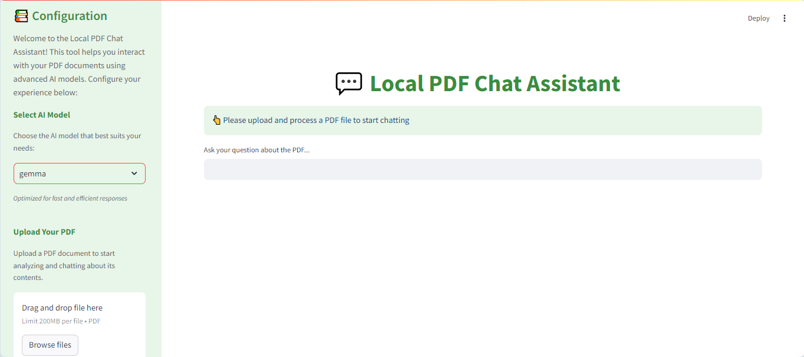

# Local PDF Chat Assistant

The **RAG-App-Multi-Model** is a powerful tool that allows users to interact with PDF documents using advanced AI language models. With features like document vectorization, text splitting, and natural language processing, this application makes it easy to analyze and query large PDFs efficiently.

## Features
- **AI-Powered Querying**: Use advanced language models (like Llama2) for intelligent question-answering.
- **PDF Vectorization**: Extracts and splits PDF content into manageable chunks for efficient retrieval.
- **Custom Themes**: A green-themed user interface for enhanced user experience.
- **Source Verification**: Displays document sources for every query.

## User Interface Preview
Here is a preview of the application's interface:



The clean and intuitive design ensures a seamless user experience.

## How to Use
1. Upload a PDF file using the sidebar.
2. Select an AI model from the available options (e.g., Llama2, Mistral).
3. Ask questions about the content of your PDF.
4. Review the responses, including source details.

## Prerequisites
- Python 3.8 or higher
- Dependencies listed in `requirements.txt`

## Setup
1. Clone the repository:
   ```bash
   git clone https://github.com/your-username/local-pdf-chat-assistant.git
   ```
2. Navigate to the project directory:
   ```bash
   cd local-pdf-chat-assistant
   ```
3. Install dependencies:
   ```bash
   pip install -r requirements.txt
   ```
4. Run the application:
   ```bash
   streamlit run app.py
   ```

---
